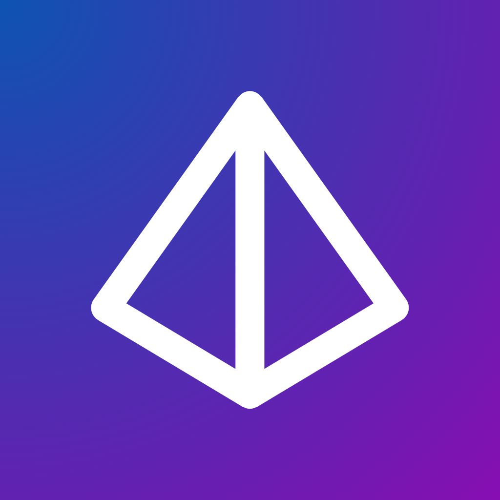

<div align="center">
  

  # Prysm 🌈

  A cutting-edge multiplatform SwiftUI application showcasing Apple's FoundationModels framework with production-ready architecture and comprehensive test coverage.

  [](https://apps.apple.com/us/app/prysm-ai/id6754121721)
  
  
  
</div>

## Overview

Prysm is a state-of-the-art demonstration of Apple's FoundationModels framework, built with Swift and SwiftUI. It provides a sophisticated chat interface with AI-powered conversations, featuring platform-adaptive designs that feel native on iOS, iPadOS, macOS, and visionOS.

**[Download on the App Store](https://apps.apple.com/us/app/prysm-ai/id6754121721)**

## Features

### 🚀 Core Capabilities

- **AI-Powered Chat** - Integration with FoundationModels for intelligent conversations
- **Streaming Responses** - Real-time message streaming with typing indicators
- **Structured Output** - @Generable support for recipes, books, travel planning, stories, business ideas, emails, and product reviews
- **Context Management** - Automatic sliding window and conversation summarization
- **Custom Instructions** - Personalize AI behavior with custom system prompts
- **Onboarding Flow** - Interactive welcome experience for new users
- **Token Tracking** - Real-time token count estimation for context awareness

### 🎨 Platform-Adaptive Design

#### iOS & iPadOS
- Glass morphism effects for modern aesthetics
- NavigationStack with sheet-based settings
- Swipe gestures and haptic feedback
- Dynamic Type and accessibility support

#### macOS
- Native NavigationSplitView with sidebar
- Window management with ideal sizing (1200x800)
- macOS-specific controls and styling

### 🛠 Technical Excellence

- **@Observable Architecture** - Modern state management without Combine
- **Comprehensive Testing** - 52 tests covering models, views, and ViewModels
- **Zero Warnings** - Production-ready code quality
- **Type Safety** - Full type safety with no force unwraps
- **Error Handling** - Robust error recovery and user feedback

## Requirements

- **Xcode 26.0+**
- **Swift 5.0+**
- **Deployment Targets:**
  - iOS 26.0+
  - iPadOS 26.0+
  - macOS 26.0+
  - visionOS 26.0+

## Project Structure

```
Prysm/
├── Prysm/                          # Main app target
│   ├── PrysmApp.swift              # App entry point with platform configs
│   ├── Constants/
│   │   ├── AppConfig.swift         # Centralized app configuration
│   │   └── Spacing.swift           # Design system constants
│   ├── Models/
│   │   ├── ChatMessage.swift       # Chat message model
│   │   ├── ConversationSummary.swift # @Generable for summarization
│   │   ├── DataModels.swift        # All @Generable structs
│   │   ├── ExampleType.swift       # Example categories enum
│   │   ├── FoundationModelsError.swift # Error handling
│   │   ├── NavigationCoordinator.swift # Navigation state
│   │   └── TabSelection.swift      # Tab navigation enum
│   ├── ViewModels/
│   │   ├── ChatViewModel.swift     # Main chat logic with streaming
│   │   └── ContentViewModel.swift  # Structured content generation
│   ├── Views/
│   │   ├── AdaptiveNavigationView.swift # Platform-adaptive navigation
│   │   ├── AssistantView.swift     # Assistant configuration hub
│   │   ├── ChatView.swift          # Main chat interface
│   │   ├── ExamplesView.swift      # Examples showcase
│   │   ├── GenerationOptionsView.swift # Model parameters
│   │   ├── InstructionsSheet.swift # Custom instructions
│   │   ├── LanguagesView.swift     # Language/model selection
│   │   ├── ModelView.swift         # Model configuration hub
│   │   ├── ModelUnavailableView.swift # Error state view
│   │   ├── SettingsView.swift      # App settings
│   │   ├── SidebarView.swift       # macOS/iPad sidebar
│   │   ├── ToolsView.swift         # Tools showcase (UI catalog)
│   │   ├── TranscriptEntryView.swift # Message display
│   │   ├── WelcomeView.swift       # Onboarding flow
│   │   └── Components/
│   │       ├── ChatInputView.swift # Message input field
│   │       └── MessageBubbleView.swift # Message bubbles
│   ├── Extensions/
│   │   ├── Color+Extensions.swift  # Color utilities
│   │   └── Transcript+TokenCounting.swift # Token estimation
│   ├── Services/
│   │   └── OnDeviceProvider.swift  # On-device model provider
│   ├── Utilities/
│   │   └── IconGenerator.swift     # Icon generation utility
│   └── Assets.xcassets/            # Images and app icons
├── PrysmTests/                     # Unit tests
│   ├── ChatViewModelTests.swift
│   ├── ContentViewModelTests.swift
│   ├── PrysmTests.swift
│   ├── SettingsTests.swift
│   └── UIComponentTests.swift
├── PrysmUITests/                   # UI tests
│   ├── PrysmUITests.swift
│   └── PrysmUITestsLaunchTests.swift
└── Scripts/
    ├── change_app_name.py          # App renaming script
    ├── generate_ai_icon.py         # AI icon generation
    ├── generate_geometric_prism.py # Geometric prism icon
    ├── generate_icons.py           # Icon generation
    ├── generate_sf_icon.swift      # SF Symbol icon generation
    ├── process_app_icon.py         # App icon processing
    └── rebrand_app.py              # App rebranding script
```

## Getting Started

1. **Clone the repository**
   ```bash
   git clone https://github.com/andrew-bierman/Prysm.git
   cd Prysm
   ```

2. **Open in Xcode**
   ```bash
   open Prysm.xcodeproj
   ```

3. **Build the project**

   **Option 1: Using Xcode**
   - Select your target platform (iOS Simulator, Mac, or visionOS Simulator)
   - Press ⌘R or click the Run button

   **Option 2: Using the build script**
   ```bash
   # Build for specific platform
   ./build.sh iOS      # Build for iOS
   ./build.sh macOS    # Build for macOS
   ./build.sh visionOS # Build for visionOS
   ./build.sh all      # Build for all platforms
   ```

## Architecture

### MVVM with @Observable

The app uses a modern MVVM architecture with Swift's @Observable macro:

```swift
@Observable
final class ChatViewModel {
    var isLoading = false
    var isSummarizing = false
    var sessionCount = 0
    var baseInstructions = ""
    var errorMessage: String?
    // ...
}
```

### FoundationModels Integration

Chat messages leverage the FoundationModels Transcript system for context management:

```swift
struct ChatMessage: Identifiable, Equatable {
    let id: UUID
    let entryID: Transcript.Entry.ID?
    let content: AttributedString
    let isFromUser: Bool
    let timestamp: Date
    let isContextSummary: Bool
}
```

### @Generable Structured Output

Create structured content with type-safe @Generable structs:

```swift
@Generable
struct Recipe: Sendable {
    @Guide("The name of the recipe")
    var name: String

    var cuisine: String
    var difficulty: RecipeDifficulty
    var prepTimeMinutes: Int
    var servings: Int
    var ingredients: [String]
    var instructions: [String]
}
```

## Key Features Implementation

### Streaming Responses

```swift
func sendMessage(_ content: String) async {
    guard !content.isEmpty else { return }

    isLoading = true
    defer { isLoading = false }

    do {
        for try await chunk in session.generateResponse(
            to: [.user(content)]
        ) {
            // Stream response in real-time
        }
    } catch {
        errorMessage = error.localizedDescription
    }
}
```

### Structured Content Generation

```swift
func generateRecipe(prompt: String) async {
    isLoading = true
    defer { isLoading = false }

    do {
        generatedRecipe = try await session.generate(
            prompt: prompt,
            as: Recipe.self
        )
    } catch {
        errorMessage = error.localizedDescription
    }
}
```

### Context Management

```swift
func applySlidingWindow() async {
    guard let session = session else { return }

    isApplyingWindow = true
    defer { isApplyingWindow = false }

    // Automatically manage context window
    try? await session.applySlidingWindow(
        maxPrecedingTokens: 4000
    )
}
```

### Platform Adaptations

```swift
struct AdaptiveNavigationView: View {
    var body: some View {
        #if os(iOS)
        if horizontalSizeClass == .compact {
            TabView(selection: $coordinator.selectedTab) {
                // iPhone: Tab-based navigation
            }
        } else {
            NavigationSplitView {
                SidebarView()
            } detail: {
                // iPad: Split view navigation
            }
        }
        #else
        NavigationSplitView {
            SidebarView()
        } detail: {
            // macOS: Split view navigation
        }
        #endif
    }
}
```

## Testing

The project includes comprehensive test coverage:

- **ChatViewModelTests** - Message handling, streaming, context management
- **ContentViewModelTests** - Structured content generation for all @Generable types
- **SettingsTests** - App configuration and preferences
- **UIComponentTests** - View components, interactions, and accessibility
- **PrysmTests** - General app functionality

Run tests with:
```bash
# All tests
⌘U in Xcode

# Specific test suite
Select test file → ⌘U
```

## Settings

### Model Configuration
- **Language & Model Selection** - Choose from available system language models
- **Generation Parameters** - Fine-tune temperature, top P, and max tokens
- **Custom Instructions** - Personalize AI behavior with system prompts

### App Settings
- **Appearance** - Light, dark, or system theme
- **Chat Settings** - Streaming preferences and context management
- **Privacy** - Data handling and usage controls
- **Accessibility** - Dynamic type and accessibility features

## Contributing

Contributions are welcome! Please feel free to submit a Pull Request.

1. Fork the project
2. Create your feature branch (`git checkout -b feature/AmazingFeature`)
3. Commit your changes (`git commit -m 'Add some AmazingFeature'`)
4. Push to the branch (`git push origin feature/AmazingFeature`)
5. Open a Pull Request

## Roadmap

### ✅ Completed
- [x] FoundationModels framework integration with streaming
- [x] 8 @Generable structured output types (Recipe, Book, Travel, Story, Business, Email, Review, Summary)
- [x] Platform-adaptive UI for iOS, iPadOS, macOS, and visionOS
- [x] Context management with automatic sliding window and summarization
- [x] Custom instructions for personalized AI behavior
- [x] Interactive onboarding and welcome flow
- [x] Real-time token tracking and context awareness
- [x] Comprehensive test suite coverage
- [x] Published to App Store

### 🚧 In Progress / Planned
- [ ] Conversation persistence (SwiftData + CloudKit sync)
- [ ] Export/import functionality (JSON, Markdown, PDF)
- [ ] Custom tool implementations (Web Search, Calculator, etc.)
- [ ] Conversation branching and history management
- [ ] Voice input/output capabilities
- [ ] Widget extensions for quick access
- [ ] Shortcuts integration
- [ ] Multi-conversation management
- [ ] Image generation integration

## Acknowledgments

- Built with Apple's latest SwiftUI and Swift technologies
- Designed following Apple's Human Interface Guidelines
- Inspired by modern AI chat interfaces

## License

This project is licensed under the MIT License - see the [LICENSE](LICENSE) file for details.

## Links

**App Store**: [Download Prysm AI](https://apps.apple.com/us/app/prysm-ai/id6754121721)

**GitHub**: [https://github.com/andrew-bierman/Prysm](https://github.com/andrew-bierman/Prysm)

---

**Note:** Prysm is built on Apple's FoundationModels framework, showcasing the power of on-device AI with Swift and SwiftUI. The app demonstrates structured content generation, streaming conversations, and intelligent context management—all running locally on your Apple devices.